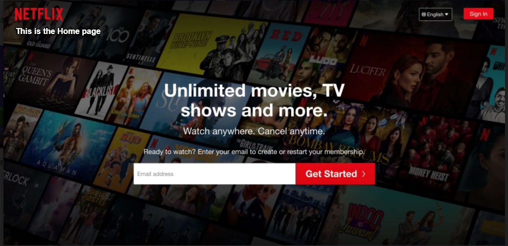
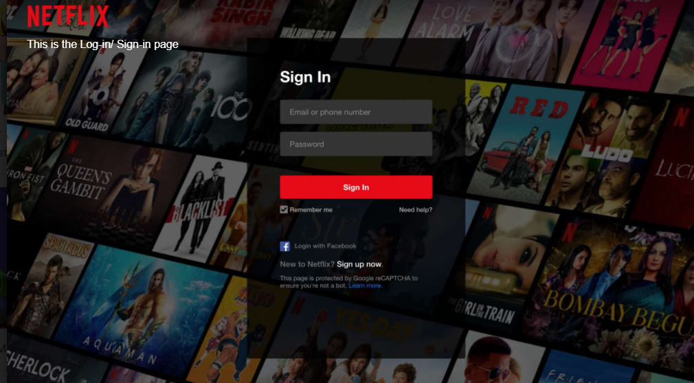
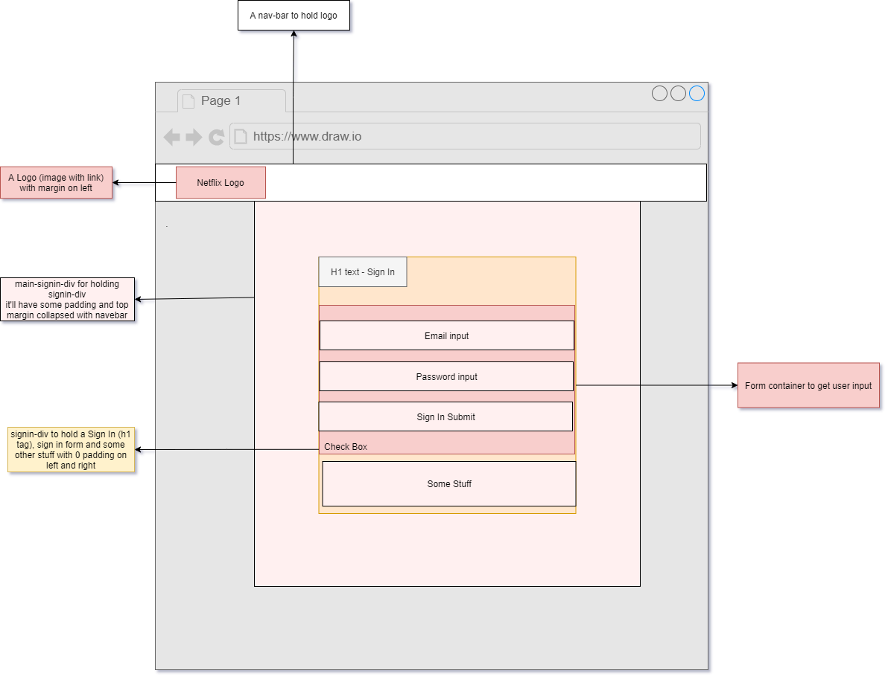

# NetFlex
# NetflixHomePageReplica

Netflix home page and log in page replica

[Live Site](https://justkishore.github.io/NetFlex/)

Copy to your [Evernote](https://www.evernote.com/shard/s433/sh/8596f4a9-6def-8a8c-d4bc-81b30533ac4e/4baeb2f30ed3876e11b41ca96b15f3bc)

---
## Problem Statement

Create a [Netflix](https://www.netflix.com/in/) home and Sign In page

---

## Requirements

- The home page should have contents displayed as per picture 1
- If the user clicks Sign In button/link it should go to Log In/ Sign In page
- On the home page, we need to have an input field  where the user could type his or her email
- There should be a Get Started button aligned right to the above input field 
- On the Sign In page, there should be a form in the center that contains the following content :
	- A header saying "Sign In"
	- A form input field for entering email
	- A form input field for entering the password
	- A Sign In button
	- Remember me checkbox and other stuff as per the picture

---

## Diagram

Prior to coding, the most important step is to design.

If images below are not clear Use these 2 links: [Home page](https://drive.google.com/file/d/1HzONglhHJoLIkjrhB0x3bWR7Sg5NjVkA/view?usp=sharing) and [Sign In page](https://drive.google.com/file/d/1ZIlXwTMbUpG8AedCiOc0J5Nt7M2jkiUB/view?usp=sharing).
### Home page 

### Sign In page

---

# Output

### Home page

### Sign In page

In next version I'll add few more elements in the **Home** and **Sign In** page and will use **Flex** concepts.
